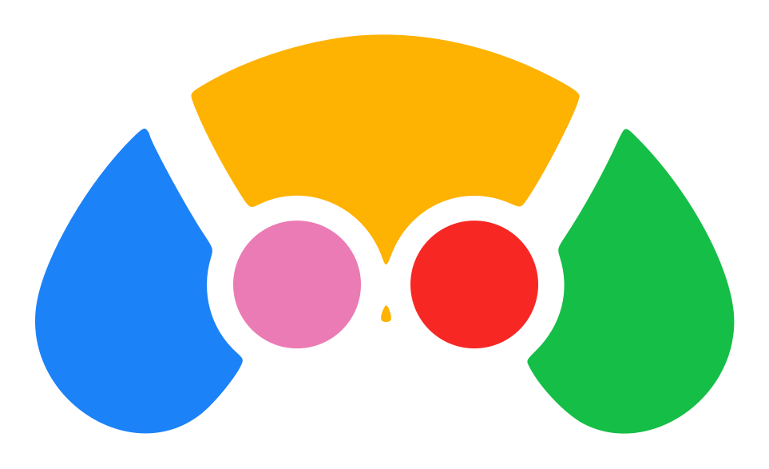

<p align="center"></p>

# Immich Minigames

Memory minigames powered by the metadata already in your [Immich](https://immich.app) library.

No generic questions: every game is about your people, your travels, your photos.
How many photos does that person have? Where was this taken? Whose face is hidden?

> Unofficial project, unaffiliated with the Immich team. Runs alongside an existing Immich instance,
> reusing its database and Immich-ML service—no separate copy of your photos is stored.

## Why?

Just why not? It's entertaining, and it rewards keeping your metadata organized. The better
labeled your library is (names, birthdays, locations), the better and more varied the games. A nice incentive
to keep your photo metadata up to date.

## The Games

| Game | Inspired by | The idea |
|---|---|---|
| **MoreOrLess** | The classic [More Or Less](https://moreorless.io/) | Does person B have more or fewer photos than person A? |
| **Geoguessr** | [GeoGuessr](https://www.geoguessr.com/) | Guess on a map where a photo was taken |
| **Dateguessr** | Geoguessr, but with dates | Guess on a timeline when a photo was taken |
| **Immichdle** | Wordle-style games ([Wordle](https://www.nytimes.com/games/wordle/)) | Guess the mystery person with comparative clues |
| **Timeline** | The board game [Timeline](https://www.zygomatic-games.com/en/game/timeline-classic/) | Place photos in chronological order |
| **Who'sThatPerson** | ["Who's That Pokémon?"](https://pokemon.fandom.com/wiki/Who's_That_Pok%C3%A9mon%3F) | Guess who the person is when their face is hidden |

Detailed gameplay for each game, including modes and scoring rules, can be found in
[`docs/GAMES/`](./docs/GAMES/OVERVIEW.md).

## Current Status

**Five games are fully playable:**
- **MoreOrLess** ✅ (PC and mobile layouts, both English and Spanish)
- **Geoguessr** ✅ (MapLibre-powered, 5-round game mode)
- **Dateguessr** ✅ (Timeline-based, 5-round game mode)
- **Immichdle** ✅ (Wordle-style person guessing with comparative clues)
- **Who'sThatPerson** ✅ (Guess person names from hidden faces in photos)

**Other games are design stubs only** (Timeline).

**Features:**
- ✅ User login (email/username/password, profile page, logout)
- ✅ Dark theme (consistent with Immich's color palette)
- ✅ Full Spanish translation (i18n-ready codebase)
- ✅ Docker support (GHCR images for easy deployment)
- ✅ Direct Postgres access for game data, Immich REST API for images
- ✅ Leaderboards (daily, weekly, all-time per game)
- ✅ User profiles with cosmetic person avatar selection
- ❌ Daily challenges (planned)
- ❌ Report incorrect metadata (planned)

Full implementation roadmap is in [`docs/TODO/ROADMAP.md`](./docs/TODO/ROADMAP.md).

## Installation & Usage

### Prerequisites

- An existing [Immich](https://immich.app) instance running Postgres (this project targets the
  Postgres 14 image Immich itself ships) and Immich-ML
- Docker and Docker Compose

There are two separate Compose files - use one or both depending on your situation:

| File | What it starts | When you need it |
|---|---|---|
| `docker-compose.yml` | Immich itself (server + ML + Postgres + Redis) | Only if you don't already have an Immich instance running |
| `docker-compose.app.yml` | This app's backend + frontend (pulled from GHCR) | Always |

If you already run Immich elsewhere, skip straight to step 3 and point `DB_HOST`/`IMMICH_SERVER_URL`
at your existing instance instead.

### 1. Clone this repository

```bash
git clone https://github.com/open-rais/immich-minigames
cd immich-minigames
```

### 2. (Optional) Start Immich itself

Skip this if you already have an Immich instance running.

```bash
cp .env.example .env
# edit .env: at minimum set UPLOAD_LOCATION and DB_DATA_LOCATION to real paths on your machine
docker compose up -d
```

Open `http://localhost:2283` to finish Immich's setup wizard, then create an API key at
**Account Settings > API Keys** - you'll need it in the next step.

### 3. Configure and start the minigames app

Finish filling in your `.env` (create it from `.env.example` if you skipped step 2):

- `DB_APP_USERNAME` / `DB_APP_PASSWORD` - pick any credentials; this app provisions the role itself
  (see below), it doesn't need to already exist
- `IMMICH_API_KEY` - the key you created in step 2 (or from your existing Immich instance)
- `JWT_SECRET` - generate with `openssl rand -hex 32`
- If pointing at an Immich instance *not* started by this repo's own `docker-compose.yml`, also set
  `DB_HOST`, `DB_PORT`, `DB_USERNAME`, `DB_PASSWORD`, `DB_DATABASE_NAME`, and `IMMICH_SERVER_URL` to
  match it

Then:

```bash
docker compose -f docker-compose.app.yml up -d
```

This does two things in order: first a one-shot `db-init` step provisions the Postgres role this
app runs as (see **Database Access & Security** below), then it starts the backend and frontend.
No manual database setup step is needed.

Open `http://localhost:${FRONTEND_PORT:-3000}` (3000 by default).

If you later rotate `DB_APP_PASSWORD` in `.env`, re-run just the role step:

```bash
docker compose -f docker-compose.app.yml run --rm db-init
```

### Development Setup

For working on this app's own code (not just running it), run each service from source instead of
its container image. This still needs Immich's Postgres role provisioned - either run `docker
compose -f docker-compose.app.yml run --rm db-init` once, or apply the same grants manually if
you're not using Docker for that step at all.

**Backend:**
```bash
cd backend
uv run alembic upgrade head  # applies pending DB schema migrations, run once (and after each pull)
uv run uvicorn main:app --app-dir src --port 8000 --reload
```

**Frontend:**
```bash
cd frontend
npm install
npm run dev
```

Both require the Immich instance and database to be running. See `docs/ARCHITECTURE/IMMICH.md` for
database schema details.

## Architecture

The backend (FastAPI) is organized in layers:
- **API** (`api/api.py`): REST endpoints, mounted routes
- **Services** (`services/`): business logic for games, Immich integration, ML
- **Domain** (`domain/`): models (Asset, Person, Album)
- **Persistence** (`persistence/games.py`): app-specific database models
- **Games** (`games/`): one module per minigame (shared contract in `base.py`)

The frontend (React + Vite + Tailwind) is organized per game under `frontend/src/games/<Game>/` with
shared components and design tokens in `index.css`.

## Database Access & Security

This app accesses the Immich Postgres database directly (read-only on Immich's own `public` schema)
to fetch game data efficiently, alongside its own separate `minigames` schema for game state.
Images are always fetched through Immich's REST API, never directly from disk or the database.

The long-running backend never holds Immich's admin database credentials
(`DB_USERNAME`/`DB_PASSWORD`). It only ever connects as a dedicated, scoped role
(`DB_APP_USERNAME`) that is:
- **read-only** on Immich's own `public` schema - a bug in a query can't write to your Immich data
- **full control**, but only on this app's own `minigames` schema - nothing outside it

That role doesn't need to exist beforehand: `docker compose -f docker-compose.app.yml up` first runs
a one-shot `db-init` step (`backend/src/scripts/bootstrap_db_role.py`) that creates or refreshes it,
then starts the backend with only its scoped credentials. `db-init` is the *only* container that
ever sees the admin credentials, and it exits immediately once the role is provisioned - see the
comments in `docker-compose.app.yml` for the exact scoping.

**Use this at your own risk.** While access to Immich's own data is read-only and images are never
touched, you run this code alongside your personal photo database. Review the source code if you
have concerns.

## Development Approach

This project is mainly **vibes-coded**. Still, The author has a software engineering background and maintains constant auditing while using AI code generation (via Claude Code). Security considerations are prioritized throughout:

- Read-only database access with a minimal role
- No storage or copying of photos
- Careful API boundary validation
- Continuous code review and refactoring
- Regular security audits with multi-agent code review

## FAQs

**Q: Is this official?**  
A: No, this is an unofficial community project unaffiliated with the Immich team.

**Q: Will my photos be copied or modified?**  
A: No. This app only reads metadata from Immich's database and fetches image thumbnails via Immich's
API. It never stores, modifies, or copies photos.

**Q: Why not just use Immich's public API?**  
A: The API doesn't expose all metadata needed for games (e.g., face similarity scores, precise location
data). Direct read-only database access allows us to query efficiently without duplicating data.

More FAQs in [`docs/FAQS.md`](./docs/FAQS.md).
